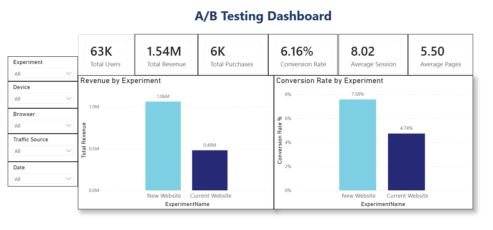
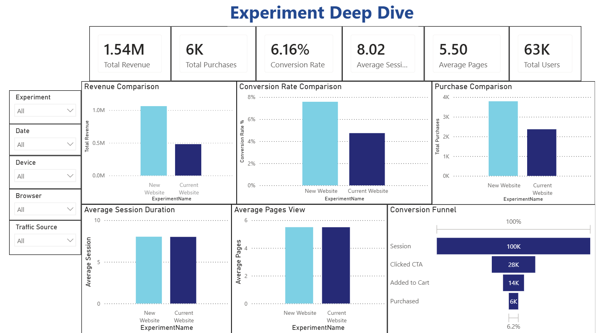
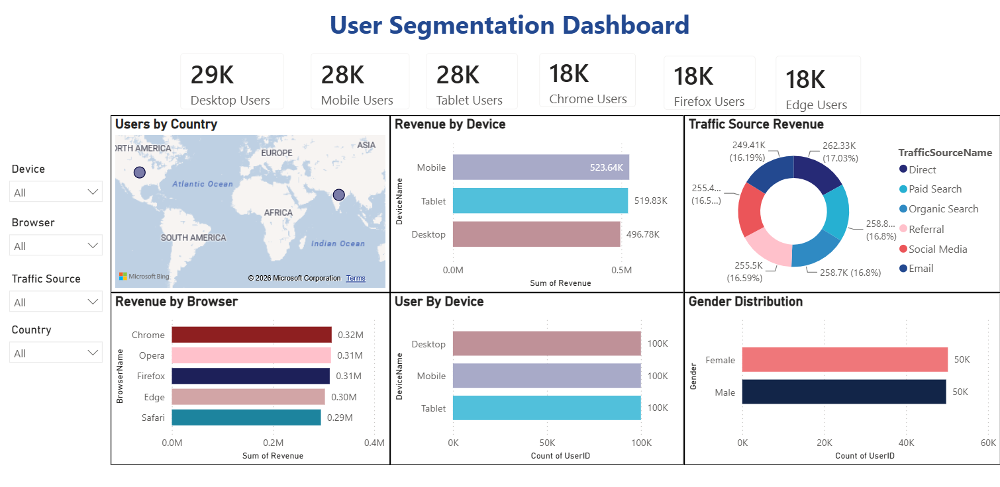
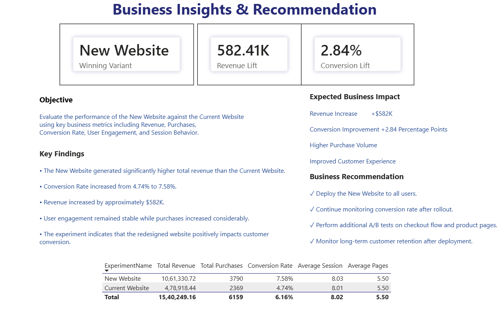

<div align="center">

# 📊 A/B Testing Product Analytics Dashboard

### End-to-End Product Analytics using SQL & Power BI

Analyze • Visualize • Optimize • Recommend

<p>


</p>

</div>

---

# 🌟 Project Overview

This project demonstrates an end-to-end **Product Analytics** workflow by evaluating the performance of an **A/B Testing experiment**.

A **Current Website (Control Group)** is compared against a **New Website (Variant Group)** using key business metrics to determine whether the redesigned experience should be deployed.

The project combines **SQL**, **Power BI**, **DAX**, and **Business Intelligence** to transform raw experiment data into actionable business insights.

---

# 🎯 Business Objective

Determine whether the **New Website** improves business performance compared to the **Current Website**.

The analysis focuses on:

- 💰 Revenue
- 🛒 Purchases
- 📈 Conversion Rate
- ⏱ Session Duration
- 📄 Pages Viewed
- 🌍 User Segmentation
- 💻 Device Performance
- 🌐 Browser Performance
- 🚦 Traffic Sources

---

# 🛠 Tech Stack

| Category | Technology |
|----------|------------|
| 📊 Dashboard | Power BI |
| 🗄 Database | SQL |
| 📐 Data Modeling | Star Schema |
| 📈 Analytics | DAX |
| 📉 Visualization | Power BI Visuals |
| 📋 Reporting | Executive Dashboards |

---

# 🏗 Project Workflow

```text
Business Problem
        │
        ▼
A/B Testing Dataset
        │
        ▼
SQL Data Model
        │
        ▼
Power BI
        │
        ▼
Interactive Dashboards
        │
        ▼
Business Insights
        │
        ▼
Executive Recommendations
```

---

# 📊 Dashboard Pages

---

## 📈 Executive Overview

A high-level summary of the experiment with executive KPIs.

### KPIs

✅ Total Revenue

✅ Total Purchases

✅ Conversion Rate

✅ Average Session Duration

✅ Average Pages Viewed

✅ Total Users

### Interactive Filters

- Experiment
- Device
- Browser
- Traffic Source
- Date



---

## 🔬 Experiment Deep Dive

Comprehensive comparison of the **Current Website** and **New Website**.

### Visualizations

- Revenue Comparison
- Purchase Comparison
- Conversion Rate Comparison
- Average Session Duration
- Average Pages Viewed
- Conversion Funnel



---

## 👥 User Segmentation Dashboard

Understand customer behavior across multiple dimensions.

### Visualizations

- 🌍 Users by Country
- 💻 Revenue by Device
- 🌐 Revenue by Browser
- 🚦 Traffic Source Revenue
- 👨 Gender Distribution
- 📱 Users by Device



---

## 💼 Business Insights & Recommendations

Executive-level summary of the A/B test.

### Includes

🏆 Winning Variant

📈 Revenue Lift

📊 Conversion Lift

📋 Executive Summary

💡 Business Recommendations

📑 KPI Comparison



---

# 📈 Key Insights

| Metric | Result |
|---------|--------|
| 🏆 Winning Variant | New Website |
| 💰 Revenue | Increased |
| 📈 Conversion Rate | Improved |
| 🛒 Purchases | Increased |
| 👥 User Engagement | Stable |
| 📊 Overall Performance | Better |

---

# 💡 Business Recommendation

Based on the analysis:

✅ Deploy the **New Website**

✅ Continue monitoring user engagement

✅ Optimize checkout flow

✅ Perform additional A/B tests

✅ Monitor long-term customer retention

---

# 🚀 Skills Demonstrated

### 📊 Product Analytics

- A/B Testing
- Funnel Analysis
- KPI Development
- Customer Segmentation

---

### 🗄 SQL

- Joins
- Aggregations
- Business Queries
- Data Analysis

---

### 📈 Power BI

- Interactive Dashboards
- DAX
- KPI Cards
- Drill-down Analysis
- Executive Reporting

---

### 💼 Business Intelligence

- Data Storytelling
- Executive Dashboards
- Decision Support
- Business Recommendations

---

# 📂 Repository Structure

```text
📁 AB-Testing-Product-Analytics

│
├── 📄 README.md
├── 📊 Power BI Dashboard.pbix
├── 📁 Dataset
├── 📁 SQL Scripts
├── 📁 Dashboard Images
│
├── 🖼 01_Executive_Overview.png.png
├── 🖼 02_Experiment_Deep_Dive.png.png
├── 🖼 03_User_Segmentation.png.png
└── 🖼 04_Business_Insights.png.png
```

---

# 👨‍💻 Author

## **Sneha Saha**

**Software QA Analyst | Aspiring Product Analyst | Data Analytics Enthusiast**

🔗 **LinkedIn**

https://www.linkedin.com/in/snehasaha2001/

💻 **GitHub**

https://github.com/Snehasaha1

---

<div align="center">

### ⭐ If you like this project, consider giving it a Star!

**Thank you for visiting my repository!**

</div>
